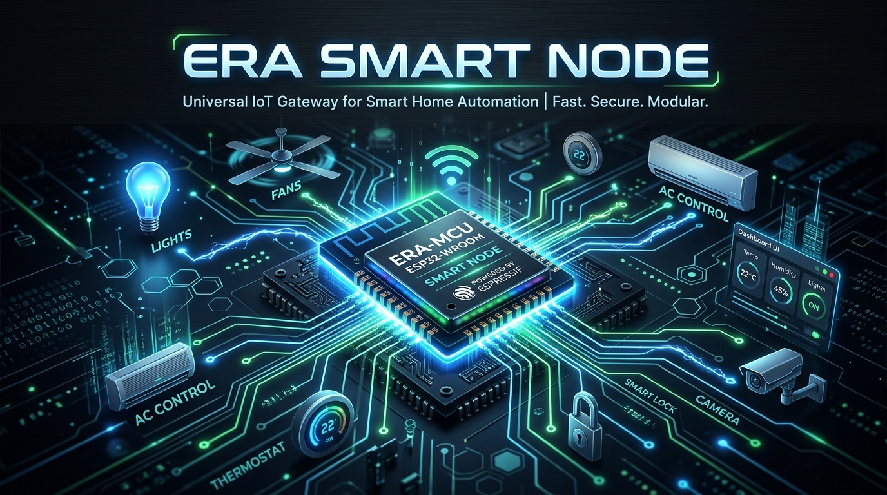
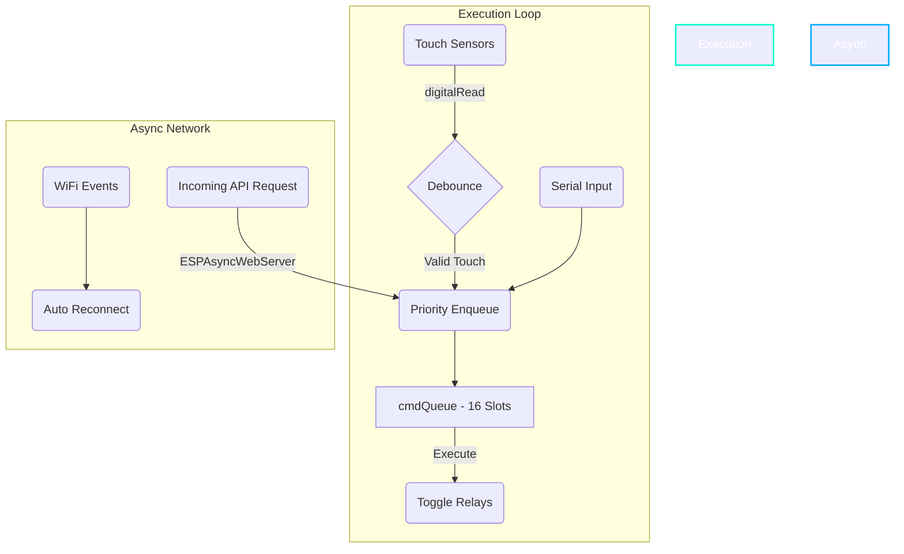

# ERA Smart Node — FreeRTOS Home Automation Hub ⚡



<p align="center">
  <a href="https://github.com/devakshay07/ERA-Smart-Relay-Node/releases"></a>
  <a href="LICENSE"></a>
  <a href="https://platformio.org/"></a>
</p>

**ERA Smart Node** is a hyper-optimized, standalone FreeRTOS firmware for the ESP32 Dev Module (38-pin), designed to serve as a robust, non-blocking controller for up to 6 smart home appliances with integrated capacitive touch fallback.

It perfectly balances lightning-fast local physical controls with comprehensive remote REST APIs via an asynchronous web server. No master server required.

## 🚀 Core Features

- **Fully Standalone:** No master server dependencies. Control it directly via local HTTP POST requests.
- **ESPAsyncWebServer:** Fully asynchronous HTTP API — no main-loop blocking.
- **Smart Queue Eviction:** A 16-slot queue prioritizes local touch over network API spam. If the network spams the queue, touch events forcibly evict old API calls.
- **Background WiFi Resilience:** Async WiFi event handling ensures the board never hangs during reconnects.

---

## 🛠️ Architecture Flowchart



---

## 🔌 Circuit Diagram (ESP32 38-Pin)

### Relays (Active-LOW) & Touch Sensors
| Appliance | ESP32 GPIO | Relay (IN) | Touch Sensor (SIG) |
| :--- | :---: | :---: | :---: |
| **Fan** | `26` / `4` | `GPIO 26` | `GPIO 4` |
| **Light** | `27` / `5` | `GPIO 27` | `GPIO 5` |
| **TV** | `14` / `18` | `GPIO 14` | `GPIO 18` |
| **AC** | `25` / `19` | `GPIO 25` | `GPIO 19` |
| **Geyser** | `33` / `23` | `GPIO 33` | `GPIO 23` |
| **Pump** | `32` / `13` | `GPIO 32` | `GPIO 13` |

*Note: Connect Relay VCC to external 5V, Touch VCC to ESP32 3.3V, and ensure a common Ground (GND).*

---

## ⚡ Getting Started (PlatformIO)

1. Clone the repository:
   ```bash
   git clone https://github.com/devakshay07/ERA-Smart-Relay-Node.git
   ```
2. Open the project folder in VSCode + PlatformIO.
3. Edit `src/main.cpp` and set your credentials in the `CONFIG` block:
   ```cpp
   const char* WIFI_SSID        = "YOUR_WIFI_SSID";
   const char* WIFI_PASSWORD    = "YOUR_WIFI_PASSWORD";
   const char* NODE_API_KEY     = "YOUR_SECRET_API_KEY";
   ```
4. Build and upload to your ESP32.

---

## 🔑 REST API Reference

All requests require the `X-API-Key` header or `?api_key=` URL parameter.

| Method | Endpoint | Description |
| :--- | :--- | :--- |
| **GET** | `/status` | Returns full system status, queue depth, and relay states. |
| **GET** | `/diag` | Returns internal FreeRTOS diagnostic counters. |
| **POST** | `/relay/<1-6>/on` | Turns the specified appliance ON. |
| **POST** | `/relay/<1-6>/off` | Turns the specified appliance OFF. |
| **POST** | `/relay/<1-6>/toggle`| Toggles the appliance state. |
| **POST** | `/relay/all/off` | Shuts down all appliances simultaneously. |
| **POST** | `/relay/all/on` | Turns on all appliances simultaneously. |

## 📝 License
This project is licensed under the MIT License - see the [LICENSE](LICENSE) file for details.

*Tags: `#ESP32` `#FreeRTOS` `#HomeAutomation` `#IoT` `#SmartHome` `#Arduino` `#PlatformIO` `#AsyncWebServer`*
