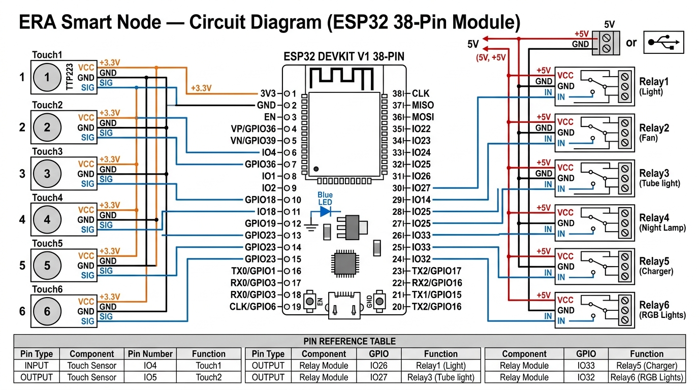
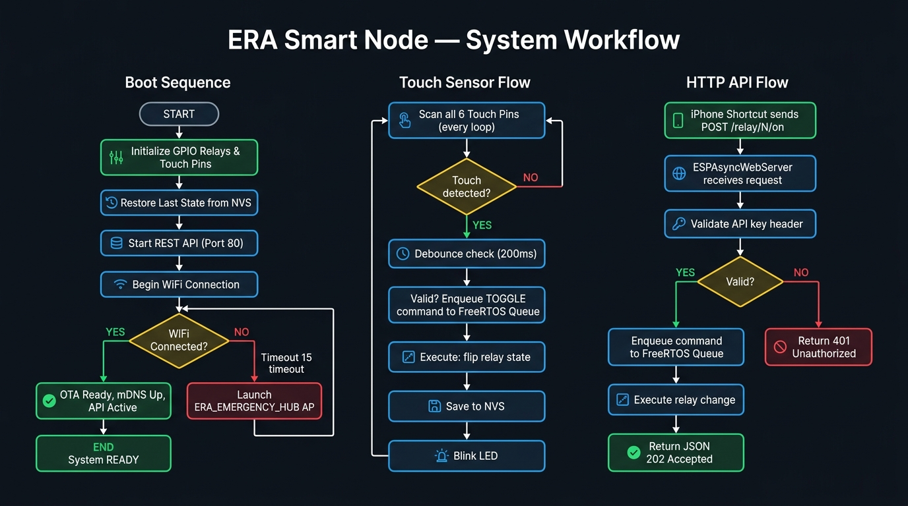

<](https://www.espressif.com/)
[](https://arduino.cc)
[](LICENSE)
[](#)

**Control 6 home appliances via capacitive touch or iPhone Shortcuts. No cloud. No subscriptions. No BS.**

[Features](#-features) · [Hardware](#-hardware-required) · [Wiring](#-circuit-diagram) · [Setup](#-getting-started) · [API Reference](#-api-reference) · [Workflow](#-system-workflow)

</div>

---

## 🧠 What is ERA Smart Node?

ERA Smart Node is a fully standalone, local-first home automation controller running entirely on an ESP32 microcontroller. It exposes a secure REST API over your local Wi-Fi, responds to physical capacitive touch pads, persists appliance state through power cuts, and survives router failures with a built-in emergency AP fallback — all with zero dependency on any cloud, server, or subscription.

**If your internet dies, your lights still work. Full stop.**

---

## ✨ Features

| Feature | Details |
|---|---|
| 🔌 **6-Channel Relay Control** | Toggle any of 6 appliances via HTTP POST or physical touch |
| 👆 **Capacitive Touch Sensors** | Each relay has a dedicated touch pad with 200ms debounce |
| 📱 **iPhone Shortcuts Integration** | Control appliances from your lock screen, Siri, or automation |
| 💾 **NVS State Persistence** | Survives power cuts — state is restored exactly as you left it |
| 📡 **Emergency AP Fallback** | If your router dies, ESP32 starts `ERA_EMERGENCY_HUB` after 15s |
| 🔄 **OTA Updates** | Flash new firmware wirelessly over your local network |
| 🔐 **API Key Authentication** | Every request validated against a secret key |
| 📊 **Live Diagnostics** | `/status` and `/diag` endpoints expose real-time metrics |
| ⚡ **FreeRTOS Queue Architecture** | Non-blocking, thread-safe command execution |
| 🔃 **mDNS Discovery** | Access your node via `era-appliance.local` instead of an IP |

---

## 🔧 Hardware Required

| Component | Quantity | Notes |
|---|---|---|
| ESP32 Dev Board (38-pin) | 1 | Any standard 38-pin DEVKIT V1 |
| 6-Channel Relay Module | 1 | 5V active-low (most standard modules are) |
| Capacitive Touch Pads / TTP223 modules | 6 | Or simple conductive pads wired to GPIO |
| 5V Power Supply | 1 | Min 1A. USB power bank works too |
| Jumper Wires | ~30 | Dupont connectors |
| USB-A to Micro-USB Cable | 1 | For first flash only |

**Estimated total cost: ₹400–₹700 / \$5–\$9 USD**

---

## 🗺️ Circuit Diagram

> ⚠️ **This diagram is specifically designed for the ESP32 38-pin DEVKIT V1 module.** Pin positions differ on 30-pin variants.



### 📌 Pin Reference Table

**Relay Outputs (5V Logic, Active LOW)**

| Relay | Appliance | GPIO Pin |
|---|---|---|
| Relay 1 | Light | GPIO 26 |
| Relay 2 | Fan | GPIO 27 |
| Relay 3 | Tube Light | GPIO 14 |
| Relay 4 | Night Lamp | GPIO 25 |
| Relay 5 | Charger | GPIO 33 |
| Relay 6 | RGB Lights | GPIO 32 |

**Touch Sensor Inputs (3.3V Logic, INPUT_PULLDOWN)**

| Touch Pad | Controls | GPIO Pin |
|---|---|---|
| Touch 1 | Light | GPIO 4 |
| Touch 2 | Fan | GPIO 5 |
| Touch 3 | Tube Light | GPIO 18 |
| Touch 4 | Night Lamp | GPIO 19 |
| Touch 5 | Charger | GPIO 23 |
| Touch 6 | RGB Lights | GPIO 13 |

**Other**

| Component | GPIO Pin |
|---|---|
| Status LED (onboard) | GPIO 2 |

> **Relay wiring note:** Relay module `IN` pins connect to the listed GPIOs. Relay module `VCC` must be connected to your **5V rail**, NOT the ESP32's 3.3V pin. The ESP32's 3.3V output cannot drive relay coils.

> **Touch sensor note:** Touch pads `VCC` connect to ESP32's **3.3V** output. Configured as `INPUT_PULLDOWN` — touch pad output goes HIGH when touched.

---

## 🚀 Getting Started

### 1. Clone the Repository

```bash
git clone https://github.com/devakshay07/ERA-Smart-Relay-Node.git
cd ERA-Smart-Relay-Node
```

### 2. Configure Your Credentials

```bash
cp include/credentials.example.h include/credentials.h
```

Now open `include/credentials.h` and fill in your details:

```cpp
const char* WIFI_SSID     = "YourWiFiName";
const char* WIFI_PASSWORD = "YourWiFiPassword";
const char* NODE_API_KEY  = "YourSecretKey";  // Used to authenticate API requests
```

> ⚠️ `credentials.h` is in `.gitignore` — it will never be committed. Your secrets stay on your machine.

### 3. Customize Your Appliances (Optional)

Open `src/main.cpp` and edit these lines to match your actual appliances:

```cpp
const char* APPLIANCE_NAMES[RELAY_COUNT] = {
  "Light", "Fan", "Tube light", "Night Lamp", "Charger", "RGB Lights"
};
```

### 4. Flash the Board

Install [PlatformIO](https://platformio.org/) (VS Code extension recommended), then:

```bash
# USB Flash (first time)
pio run --target upload --upload-port /dev/cu.usbserial-XXXX

# OTA Flash (after first USB flash)
# Uncomment upload_protocol and upload_port in platformio.ini first
pio run --target upload
```

### 5. Verify It's Running

Open Serial Monitor at 115200 baud. You should see:

```
=====================================
  ERA Smart Node -- Standalone (v4)
=====================================
[INIT] Relay 1 (Light) GPIO 26 -> Restored OFF
...
[API] Async REST API ready on port 80
[WIFI] Connected: 192.168.X.X
ERA Smart Node is READY!
```

---

## 📱 iPhone Shortcuts Setup

This is the killer feature. Add these to the iOS Shortcuts app for one-tap or Siri control.

**Shortcut configuration for "Turn on Fan":**

| Field | Value |
|---|---|
| Method | `POST` |
| URL | `http://192.168.X.X/relay/2/on` |
| Header Key | `X-API-Key` |
| Header Value | `YourSecretKey` (what you set in credentials.h) |
| Body | *(none required)* |

Replace `192.168.X.X` with your ESP32's IP address from the serial monitor.

**Available URL patterns:**

```
POST /relay/{1-6}/on       → Turn ON relay N
POST /relay/{1-6}/off      → Turn OFF relay N
POST /relay/{1-6}/toggle   → Toggle relay N
POST /relay/all/on         → Turn ON all relays
POST /relay/all/off        → Turn OFF all relays
GET  /status               → Full JSON status of all relays
GET  /diag                 → Diagnostics (command counts, drops, etc.)
```

> **💡 Pro tip:** Add shortcuts to your iPhone's Lock Screen widgets or create a Siri phrase like *"Hey Siri, run Night Mode"* that chains multiple relay commands together.

---

## 📡 API Reference

All endpoints require the header `X-API-Key: <your_key>` (except `GET /status` and `GET /diag`).

### Toggle a Relay

```bash
curl -X POST http://era-appliance.local/relay/1/on \
     -H "X-API-Key: YourSecretKey"
```

**Response (202 Accepted):**
```json
{
  "ok": true,
  "relay": 1,
  "state": true,
  "msg": "queued"
}
```

### Get Full Status

```bash
curl http://era-appliance.local/status
```

**Response:**
```json
{
  "node_id": "appliance-01",
  "name": "ERA Appliance Node",
  "ip": "192.168.1.108",
  "uptime_ms": 3600000,
  "relays": {
    "1": { "name": "Light", "state": true, "pin": 26 },
    "2": { "name": "Fan",   "state": false, "pin": 27 }
  }
}
```

### Serial Commands

With Serial Monitor open at 115200 baud:

| Command | Action |
|---|---|
| `R1:ON` | Turn on Relay 1 |
| `R3:TOGGLE` | Toggle Relay 3 |
| `ALL:OFF` | Kill everything |
| `STATUS` | Print JSON status |
| `DIAG` | Print diagnostic counters |

---

## 📊 System Workflow



### Architecture Deep-Dive

The firmware is built around a **FreeRTOS command queue**. No matter what triggers a relay change (touch, HTTP, or serial), the command is always enqueued into a 16-slot queue and executed by a single dedicated hardware loop. This means:

- **No race conditions.** Touch and HTTP can fire simultaneously — the queue serializes them.
- **No blocking.** The async web server never stalls waiting for a relay to flip.
- **Non-blocking AP fallback.** A timer in the main loop fires after 15 seconds without Wi-Fi and starts `ERA_EMERGENCY_HUB` (password: `12345678`) while continuing to reconnect in the background. When your router recovers, the AP shuts down automatically.

---

## 🗂️ Project Structure

```
ERA-Smart-Relay-Node/
├── src/
│   └── main.cpp              # Core firmware
├── include/
│   ├── credentials.example.h # Template — copy this
│   └── credentials.h         # Your secrets (gitignored)
├── assets/
│   ├── banner.jpg
│   ├── circuit_diagram.jpg
│   └── workflow.jpg
├── platformio.ini            # Build configuration
└── README.md
```

---

## ⚙️ platformio.ini Reference

```ini
[env:esp32dev]
platform = espressif32
board = esp32dev
framework = arduino
board_build.partitions = min_spiffs.csv
monitor_speed = 115200

lib_deps =
    bblanchon/ArduinoJson @ ^6.21.3
    mathieucarbou/ESPAsyncWebServer @ ^3.1.5
    mathieucarbou/AsyncTCP @ ^3.2.5

; Uncomment for OTA updates after first USB flash:
; upload_protocol = espota
; upload_port = 192.168.X.X
```

---

## 🛠️ Customization

**Change relay count:** Edit `#define RELAY_COUNT` and update the `RELAY_PINS` and `TOUCH_PINS` arrays.

**Disable active-low logic:** If your relay module is active-HIGH, set:
```cpp
const bool RELAY_ACTIVE_LOW = false;
```

**Change AP fallback timeout:** Default is 15 seconds:
```cpp
const int AP_TIMEOUT_MS = 15000; // milliseconds
```

**Change AP password:**
```cpp
WiFi.softAP("ERA_EMERGENCY_HUB", "YourPassword");
```

---

## 📜 License

MIT License — Use it, hack it, ship it.

---

<div align="center">

**Built with obsession. No cloud required.**

*ERA Smart Node v4.0*

</div>
]]>
